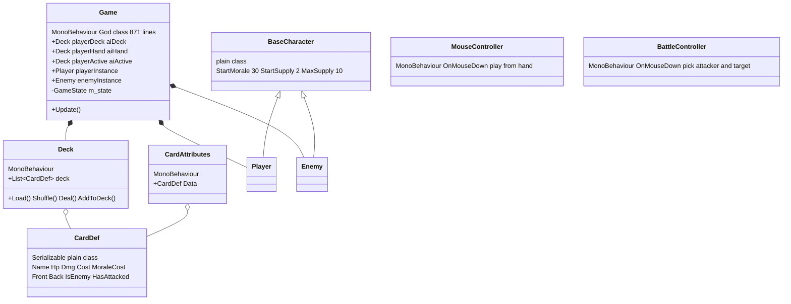
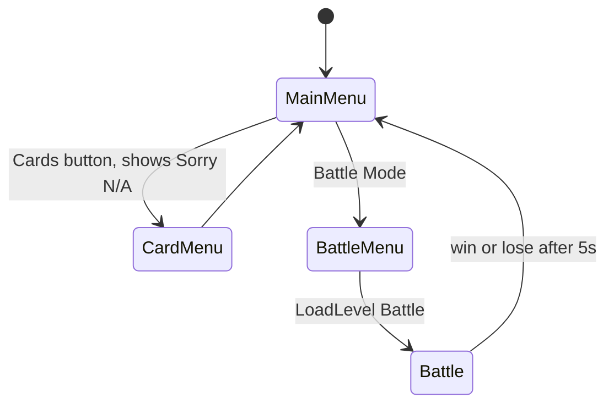

# Architecture

**Status:** Reverse-engineered 2026-07-28. Reflects the code as committed, not the shipped `HToW.exe` (see "Build drift" below).

---

## 1. Facts about the project

| Property | Value |
|---|---|
| Unity version | **4.3.4f1** (released Feb 2014) |
| Product name | Hibernia: Tales of Warfare |
| Company | Niall Gaffney |
| Language | C# (Mono, ~.NET 2.0 subset) |
| Serialization mode | **Force Binary** — scenes/prefabs/assets are not text |
| Total gameplay code | 16 `.cs` files, ~35 KB |
| Git history | 3 commits, all 2017-03-06 |
| Repo size driver | `HToW.exe` (11 MB) + `HToW_Data/` (14 MB) are committed; `Assets/` is only ~155 files |

The repo is ~26 MB but **~25 MB of that is committed build output**, not source. There is no `.gitignore`.

---

## 2. Folder structure

```
HToW/
├── Assets/
│   ├── celtic.txt, viking.txt        ← THE deck files actually loaded at runtime
│   ├── Materials/
│   │   ├── Audio/                    MainMenu 1.mp3, Battle1.mp3
│   │   └── Textures/                 Battle/, Cards/, Menus/  (+ 3 committed Thumbs.db)
│   ├── Prefabs/                      6 prefabs, 4 of them broken or empty
│   ├── Resources/                    card art, font, + DEAD duplicate celtic/viking.txt
│   │   ├── CardData/OldMethod/       6 orphaned ScriptableObjects (no matching C# class)
│   │   └── DeckData/OldMethod/       3 orphaned ScriptableObjects (no matching C# class)
│   ├── Scenes/                       MainMenu, Battle, Level1, + a Dropbox conflict copy
│   └── Scripts/
│       ├── Game.cs                   ← 871 lines, the God class
│       ├── MusicManager.cs, MyUnitySingleton.cs
│       ├── Cards/                    CardAttributes.cs (+CardDef), Deck.cs
│       ├── Controller/               BattleController.cs, MouseController.cs, GameButton.cs
│       ├── Menus/                    UI.cs, OldUnusedCode/ (3 dead files)
│       └── Players/                  BaseCharacter.cs, Player.cs, Enemy.cs
├── Docs/
├── HToW_Data/                        committed 2014 build output + runtime logs
├── ProjectSettings/
└── HToW.exe                          committed 2014 build
```

### Orphaned `.meta` files — evidence of deleted systems

Three folder `.meta` files exist with no corresponding folder. Unity only creates these for folders that once existed:

- `Assets/Data.meta`
- `Assets/Scripts/Battles.meta`
- `Assets/Scripts/Cards/CardLibrary.meta`

A `CardLibrary` and a `Battles` folder were deleted. This corroborates the orphaned ScriptableObjects (§6).

---

## 3. Scenes

Build Settings lists **five entries, two of which point at scenes that no longer exist**, and lists `Battle.unity` twice:

```
Assets/Scenes/MainMenu.unity     ✔ exists
Assets/Scenes/BattleMenu.unity   ✘ MISSING
Assets/Scenes/CardMenu.unity     ✘ MISSING
Assets/Scenes/Battle.unity       ✔ exists
Assets/Scenes/Battle.unity       ✔ duplicate entry
```

`Level1.unity` exists but is **not in Build Settings** and contains only a `Main Camera` — an empty shell, presumably the intended campaign/overworld scene.

### MainMenu.unity
```
Main Camera
Background Image   (GUITexture)
MusicController
<UI.cs host>       — immediate-mode OnGUI menu
```

### Battle.unity (the only real gameplay scene)
```
Main Camera
Background
MusicController
Game                        ← Game.cs lives here
├── Button1                 GameButton, Message="EndTurn"
├── MessagePlayerWin        TextMesh "Victory is yours!"
├── MessagePlayerTurn       TextMesh "It's your turn"
├── MessageAIWin            TextMesh "You have been defeated"
└── MessageAITurn           TextMesh "Enemy's turn"
Deck-Player      ┐
Deck-Enemy       │
Hand-Player      ├─ six GameObjects, each carrying a Deck.cs component.
Hand-Enemy       │  These are wired into Game.cs's six public Deck fields.
Active-Player    │
Active-Enemy     ┘
General-Player   ← art + object exist, NO code references them
General-Enemy    ←
playerHealth     ┐
enemyHealth      ├─ TextMesh HUD elements.
playerSupply     │  NOTHING in the codebase ever writes to these.
enemySupply      ┘
```

Two whole subsystems are visible here as scene objects with **zero backing code**: the Generals, and the entire HUD readout.

---

## 4. Class map



`Game.cs` is ~60% of all gameplay code and owns: state machine, turn order, deck building, card instantiation, GameObject construction, sprite loading, layout maths, AI card selection, AI targeting, combat resolution, win checking, and UI message toggling.

---

## 5. Runtime object model

Cards are **not prefabs**. Every card is constructed procedurally in code at runtime:

```csharp
GameObject newObj = new GameObject();
newObj.name = c1.Name;
newObj.tag  = c1.Name;                       // ← requires a matching Tag to exist
newObj.AddComponent<CardAttributes>();
newObj.AddComponent<BoxCollider>();          // 3D collider in a 2D sprite game
newObj.AddComponent<MouseController>();      // or BattleController
newObj.AddComponent<SpriteRenderer>();
Resources.Load<Sprite>(store);               // sprite lookup by string, per card
```

There are four near-identical copies of this block (`AddToPlayerHand`, `AddToEnemyHand`, `AddToActivePlayer`, `AddToActiveAi`) differing only in parent, y-position and which controller is attached. This is the largest single duplication in the codebase.

Consequences:
- No prefab means no designer-editable card visuals; layout is hardcoded magic numbers.
- Cards are identified across systems by **string name**, used simultaneously as GameObject name, Unity Tag, and lookup key.
- Tags must be pre-registered in `TagManager`. They are — **except `Battle Chariot`** (see `KnownBugs.md`).

---

## 6. Data layer — two competing designs, neither finished

**Current (in use): flat text files + a hardcoded switch.**

`Deck.Load()` reads `Application.dataPath + "/" + file` and passes the lines to `AddToDeck()`, which is a chain of `if (line == "1") … if (line == "9")` literally constructing each `CardDef` inline. Card stats therefore live in `Deck.cs` source code.

Deck files are lists of card IDs, one per line:
- `Assets/celtic.txt` → `1,2,3,1,7` (5 cards)
- `Assets/viking.txt` → `4,4,4,5,5,6,6,5,6,8,9` (11 cards)

`Assets/Resources/celtic.txt` and `viking.txt` are **dead duplicates with different contents** — nothing loads them (`Deck.Load` uses `File.ReadAllLines`, not `Resources.Load`).

**Abandoned (the better design): ScriptableObjects.**

`Assets/Resources/CardData/OldMethod/*.asset` are real serialized assets for a class `CardInfo` with a richer schema than today's `CardDef`:

| CardInfo field | Meaning | Exists in current CardDef? |
|---|---|---|
| `cid` | card id | ✘ |
| `cname` | name | ✔ `Name` |
| `chp` / `cdmg` | hp / damage | ✔ |
| `scost` | supply cost | ✔ `Cost` |
| `mcost` | morale cost | ✔ `MoraleCost` |
| `ctype` | card type — value present: `Warrior` | ✘ |
| `ceffect` | **card ability** — values present: `Volley`, `United`, `Berserker`, `Bloodrush` | ✘ |

`DeckData/OldMethod/{Celtic,Viking,Custom}.asset` hold `deckName` + `deckElements`.

**The C# classes `CardInfo` and its deck container no longer exist in `Assets/Scripts`.** These assets are unloadable orphans. The deleted `Assets/Scripts/Cards/CardLibrary/` folder (see the orphan `.meta`) is where they lived.

This is the most significant archaeological find in the project: a card-type and card-ability system was designed and partially data-authored, then the code was deleted and replaced by the cruder hardcoded switch. `Custom.asset` also implies a deckbuilder screen was planned.

---

## 7. Game flow (as built)



`UI.cs` swaps a delegate between three `OnGUI` methods — these are menu *modes* inside one scene, not separate scenes. `Level1.unity` (empty) is the never-built campaign scene.

There is **no** campaign layer, no progression, no save system, no deckbuilding UI, no card browser. The game is a single hardcoded Celtic-vs-Viking skirmish reachable in three clicks.

---

## 8. Battle state machine (`Game.m_state`)

`GameState` declares nine states: `Initial, Begin, Pending, Resolved, PlayerTurn, AITurn, Pause, PlayerWin, AIWin`.

`Pending` and `Pause` are **never assigned or read**. `Resolved` is assigned and immediately tested in the same breath (`m_state = Resolved; if (m_state == Resolved) EndTurn();`) — a tautology.

`Start()` also abuses `m_state` as a scratch parameter: it sets `m_state = PlayerTurn`, calls `BuildDeck()`, sets `m_state = AITurn`, calls `BuildDeck()` again — using the state machine to pass an argument that should have been a method parameter.

The real loop is `Update()`:

```csharp
if (m_state == GameState.Begin)
    for (int x = 0; x < 2; x++) { ChangeTurn(); LaunchTurn(); CheckForWinner(); }
```

This executes **a full player turn and a full AI turn on every single frame**, forever. See `GameplayLoop.md` — this is the project's defining defect and the "Fix turn system" item in the README.

---

## 9. Subsystems that do not exist

Despite being implied by scene objects, art, or the project vision:

| System | Evidence it was intended | Code |
|---|---|---|
| HUD (health/supply readout) | 4 TextMesh objects, `hp.png`, `supplyicon.png` | none |
| Generals / heroes | `General-Player`/`General-Enemy` objects, `celticGeneral.png`, `vikingGeneral.png` | none |
| Card abilities | `ceffect`: Volley, United, Berserker, Bloodrush | none |
| Card types | `ctype`: Warrior | none |
| Deckbuilder | `Custom.asset`, "Cards" menu button | button shows "Sorry N/A" |
| Campaign / progression | `Level1.unity`, project vision | none |
| Save / load | `MenuGUI.cs` "Continue" button (commented out) | none |
| Animation / effects | `const float FlyTime = 0.5f` in `Game.cs`, never used | none |
| Audio management | `MusicManager.cs` | broken, unattached |

---

## 10. Build drift

`HToW_Data/output_log.txt` (a real 2014 play session) contains `Debug.Log` strings that **do not exist anywhere in the current source**: `"Mouse over collider"` (216×), `"Yay"`, `"Temp contains"`. The committed `HToW.exe` was therefore built from a different revision than the committed source.

**Do not treat the .exe as a reference for current behaviour.** It should be removed from the repo along with `HToW_Data/` — but read the log first (§11).

---

## 11. Where the useful information is

- `HToW_Data/output_log.txt` — 37k lines from a genuine 2014 session. Contains a real stack trace and turn-count evidence. Extremely valuable; summarised in `GameplayLoop.md` §4 before deletion.
- `Assets/Resources/*/OldMethod/*.asset` — the only surviving record of the intended card schema. Values extracted into §6 above.
