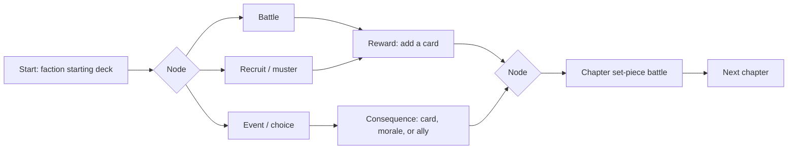

# Campaigns

**Status: nothing exists.** `Level1.unity` is an empty scene containing a single camera and is not in Build Settings. There is no campaign code, no progression, no save system, and no map. This is the ~0%-complete part of the project.

This document is a **proposal**, not a specification. It depends on open question **Q-02** in `Decisions.md` (linear campaigns vs. run-based structure), which is unresolved.

---

## 1. The structural question

| | Linear campaign (original vision) | Run-based (Hand of Fate style) |
|---|---|---|
| Structure | Fixed sequence of scripted battles | Branching map of encounters, randomised |
| Deckbuilding | Before the campaign, in a menu | **During** the run, as rewards |
| Replayability | Low — needs difficulty tiers bolted on | **High, for free** |
| Storytelling | Strong — can tell Clontarf beat by beat | Weaker — emergent, not authored |
| History delivery | Cutscenes and text between battles | **Encounter/choice nodes** |
| Build cost | Lower per campaign, higher per hour of play | Higher up front, much cheaper to extend |
| Failure state | Retry the battle | Run ends, meta-progression persists |

**My recommendation: run-based**, for three reasons — replayability is on your stated goals list and this gets it for free; deckbuilding-during-play is more interesting than menu deckbuilding *and* simplifies Milestone 6; and historical events work far better as choice nodes than as cutscenes.

**The honest cost:** you lose the ability to tell a specific historical story in order. If narrating Clontarf beat by beat matters more to you than replayability, choose linear — but then plan where replayability will come from instead.

**A middle path worth considering:** a fixed sequence of *chapters*, each of which is a short randomised run. Keeps historical chronology and authored set-piece battles, while the route through each chapter varies.

---

## 2. Proposed campaign set

Ordered by build priority, not chronology.

### C1 — Celtic Ireland *(build this first)*
- **Period:** pre-Viking, ~7th–8th century.
- **Theme:** cattle raids, hostages, inter-*túath* rivalry. War as politics, not conquest.
- **Starting deck:** small, cheap, numerous Gaelic infantry. `United` synergies.
- **Why first:** simplest mechanics, no foreign faction needed, and it teaches the core loop. It is also the period least represented in popular culture, so it's where the project is most distinctive.
- **Teaching goal:** early Irish warfare was raiding and prestige, not annihilation — which is exactly what `MoraleCost` models.

### C2 — Viking Invasions
- **Period:** ~795–950.
- **Theme:** raids escalating into *longphorts* and permanent towns.
- **Twist:** the player can **ally** with Norse Dublin. Do not build "Irish good, Vikings bad" — it is historically wrong and mechanically duller.
- **New mechanics:** ships/mobility, coastal raid nodes, mercenary hiring.

### C3 — Brian Boru
- **Period:** ~976–1014, ending at Clontarf.
- **Theme:** a minor dynasty rising to the High Kingship through alliance and betrayal.
- **Twist:** **Irish and Norse fight on both sides at Clontarf.** Make the player *build* the alliance that wins it — the diplomacy is the game.
- **Set-piece:** Clontarf as the authored final battle. Victory *and* Brian's death. A game where you win and your king dies is a strong ending.

### C4 — Norman Invasion
- **Period:** 1169–1175.
- **Theme:** asymmetry. Mailed cavalry, archers, and castles against light Gaelic infantry.
- **New mechanics:** fortification cards that raiding cannot remove; heavy cavalry that outclasses your existing deck.
- **Teaching goal:** the player should *feel* why the Gaelic military system lost, by losing to it — then find the tactics that actually worked (avoid pitched battle, harass, use terrain).
- **This is the campaign that best demonstrates teaching-through-mechanics.** Build it once the system is proven.

### Later candidates
Gallowglass era (13th–16th c. — the correct home for `gallóglaigh`, which would be anachronistic in C1–C3) · Nine Years' War · Cromwellian conquest. All out of scope for now.

---

## 3. Proposed run structure

- **Battle nodes** — the existing combat system. Everything already built feeds straight in.
- **Event nodes** — historical choices with mechanical consequences. Cheapest content to author, highest history-teaching value per hour of work.
- **Recruit nodes** — deckbuilding as a reward, not a menu.
- **Set-piece battles** — authored, historically specific, with special rules.

**Persistent state between battles:** current deck, morale carried forward (or not — a real design lever), allies gained, and a resource for hiring.

---

## 4. What must exist first

Campaign work is **Milestone 7** — deliberately late. It depends on:

| Prerequisite | Milestone | Why |
|---|---|---|
| A battle you can win or lose | M4 | There is nothing to string together otherwise |
| An AI that plays legally | M5 | Every campaign node is a battle against it |
| `DeckData` / `CardData` as ScriptableObjects | M2 | Campaigns are *data*; they cannot be built on `.txt` files and hardcoded `if` chains |
| Save/load | M6 | A run that cannot be resumed is not a campaign |
| Card abilities | M2 data model / M8 impl. | Faction identity needs more than three numbers |

**Do not start campaign work early.** It is the most attractive part of the project and the one most likely to waste effort — every campaign built on a broken battle system has to be rebuilt.

---

## 5. Minimum shippable campaign

If the goal is a finished game rather than an endless one (open question Q-04), the target is:

> **One campaign — Celtic Ireland — with ~10 nodes, 3 battles, 4 event nodes, and one set-piece finale.**

Roughly 25–30 cards, one faction plus one opponent faction, one map. That is a complete, replayable, finishable game that honours the vision. Everything else is expansion.

**Build the vertical slice before the breadth.** A single polished campaign is worth more than four unfinished ones — and it's the difference between a project you can be proud of and another decade of good intentions.
