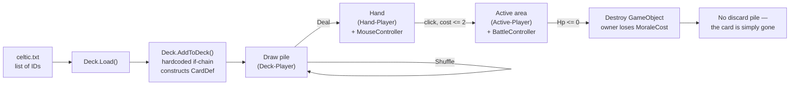

# Card & Deck System

**Reverse-engineered 2026-07-28.**

---

## 1. The card model

`CardDef` (in `Assets/Scripts/Cards/CardAttributes.cs`) is a `[System.Serializable]` plain class:

| Field | Type | Purpose |
|---|---|---|
| `Name` | string | display name — **and** GameObject name, Unity tag, and removal key |
| `Hp` | int | health; mutated in place during combat |
| `Dmg` | int | damage dealt when attacking |
| `Cost` | int | supply cost to play |
| `MoraleCost` | int | morale the **owner** loses when this card dies |
| `Front` | string | Resources path of the face sprite |
| `Back` | string | always `"back"` |
| `IsEnemy` | bool | ownership |
| `HasAttacked` | bool | per-turn attack flag — **never reset** (bug F2) |

`CardAttributes` is a `MonoBehaviour` whose only job is to hold a `CardDef`, bridging the data object to its runtime GameObject.

**Design note:** `MoraleCost` is the most interesting stat in the game. It means a card's death damages its owner — so a deck's total MoraleCost is effectively its life pool. See `GameDesign.md` §2.

---

## 2. The full card roster (9 cards)

Stats are hardcoded in `Deck.AddToDeck()`.

| ID | Name | HP | Dmg | Cost | Morale | Sprite | Faction (by deck use) |
|---:|---|---:|---:|---:|---:|---|---|
| 1 | Battle Chariot | 4 | 2 | 1 | 2 | `battleChariot` | Celtic |
| 2 | Ceithern | 8 | 4 | 3 | 6 | `ceithern` | Celtic |
| 3 | Fianna | 12 | 12 | 4 | 10 | `fianna` | Celtic |
| 4 | Raider | 4 | 4 | 2 | 4 | `raider` | Viking |
| 5 | Bondi | 8 | 4 | 4 | 5 | `bondi` | Viking |
| 6 | Huscarl | 12 | 15 | 6 | 10 | `huscarl` | Viking |
| 7 | MercArcher | 4 | 2 | 1 | 1 | `archer` | Mercenary |
| 8 | Sellsword | 4 | 10 | 3 | 5 | `sellsword` | Mercenary |
| 9 | Captain | 15 | 10 | 6 | 10 | `captain` | Mercenary |

There is no `Faction` field — factions exist only implicitly in which `.txt` file lists which IDs. Mercenaries (7–9) appear in both decks, which reads as a deliberate "hire mercenaries" theme.

### Historical naming
Names are genuinely well chosen and worth keeping:
- **Ceithern** (kern) — light Irish infantry, historically accurate.
- **Fianna** — the mythological warrior bands of Fionn mac Cumhaill. *Mythology, not history* — flag it as such in-game.
- **Battle Chariot** — Celtic chariot warfare; attested in Irish sources, though largely obsolete by the Viking era.
- **Bondi** — free Norse farmer-warriors (*bóndi*). Accurate.
- **Huscarl** — household troops (*húskarl*). Accurate.

---

## 3. Balance analysis

Using a rough "stat points per supply" measure (HP + Dmg) / Cost:

| Card | HP+Dmg | Cost | Ratio | Verdict |
|---|---:|---:|---:|---|
| MercArcher | 6 | 1 | 6.0 | fine (chaff) |
| Battle Chariot | 6 | 1 | 6.0 | fine |
| Fianna | 24 | 4 | **6.0** | **overpowered** — best card in the game |
| Raider | 8 | 2 | 4.7 | fine |
| Sellsword | 14 | 3 | 4.7 | glass cannon, fine |
| Ceithern | 12 | 3 | 4.0 | weak |
| Captain | 25 | 6 | 4.2 | weak for cost |
| Huscarl | 27 | 6 | 4.5 | weak for cost |
| Bondi | 12 | 4 | 3.0 | **worst card in the game** |

Concrete problems:
1. **Fianna (12/12 for 4)** has the stat efficiency of a 1-cost card at 4 cost. It out-trades Huscarl, which costs 50% more.
2. **Bondi (8/4 for 4)** is dominated by Ceithern (8/4 for 3) — same statline, higher cost. There is no reason to ever play it.
3. **Sellsword (4/10 for 3)** strictly out-damages Ceithern for the same cost. Since combat has no retaliation (see §5), its 4 HP is nearly costless — making it far better than intended.
4. **The 6-cost cards are unreachable.** Supply starts at 2, gains +1/turn, caps at 10. Huscarl and Captain arrive on turn 5 at the earliest — in a game where the Celtic deck runs out of cards on turn 1.

None of this is currently observable in play, because bug C4 makes everything above cost 2 unplayable anyway.

---

## 4. Deck data — three formats, one in use

### (a) Live format: flat text ID lists

`Deck.Load(file)` reads `Application.dataPath + "/" + file`:
- Editor → `Assets/celtic.txt`
- Build → `HToW_Data/celtic.txt`

| File | Contents | Cards | Total MoraleCost |
|---|---|---:|---:|
| `Assets/celtic.txt` | 1,2,3,1,7 | 5 | 21 |
| `Assets/viking.txt` | 4,4,4,5,5,6,6,5,6,8,9 | 11 | 72 |

Both decks are far too small (5 and 11 cards) and unbalanced against each other.

### (b) Dead duplicates — contents preserved here before deletion
`Assets/Resources/celtic.txt` and `Assets/Resources/viking.txt` are loaded by nothing (`Deck.Load` uses `File.ReadAllLines`, not `Resources.Load`) and have **different contents** from the live files. Recorded before removal in Milestone 0:

| Dead file | Contents | Cards |
|---|---|---:|
| `Resources/celtic.txt` | 1,2,1,3,3,2,8,7,1,1,3,3 | 12 |
| `Resources/viking.txt` | 4,5,6,6,4,7,7,4,5,5,6 | 11 |

Both are larger and better-mixed than the live 5-card Celtic deck, so they probably represent a later, abandoned balance pass. Useful reference material for Milestone 4.

### (c) Abandoned: ScriptableObjects — the design that got away

`Assets/Resources/CardData/OldMethod/*.asset` are serialized assets for a class `CardInfo` **whose C# file has been deleted** (see the orphan `Assets/Scripts/Cards/CardLibrary.meta`). Field names recovered from the binary:

```
cid, cname, chp, cdmg, scost, mcost, ctype, ceffect
```

**Fully recovered values** (decoded from the binary data blocks 2026-07-28; field order `cid, scost, mcost, cdmg, chp, cname, ctype, ceffect` confirmed by cross-checking against `Deck.cs`):

| Asset | cid | scost | mcost | cdmg | chp | ctype | ceffect |
|---|---:|---:|---:|---:|---:|---|---|
| Ceithern | 1 | 2 | 10 | 4 | 8 | Warrior | **United** |
| BattleChariot | 2 | 1 | 5 | 2 | 4 | Warrior | **Volley** |
| Fianna | 3 | 4 | 20 | 12 | 12 | Warrior | **Berserker** |
| Raider | 4 | 2 | 5 | 4 | 4 | Warrior | **Bloodrush** |
| Bondi | 5 | 3 | 10 | 4 | 12 | Warrior | **United** |
| Huscarl | 6 | 6 | 20 | 15 | 12 | Warrior | **Berserker** |

Raw trailing int sequences (first two values are container/array header, retained for reference): `Ceithern 1,1,1,2,10,4,8` · `BattleChariot 1,1,2,1,5,2,4` · `Fianna 1,1,3,4,20,12,12` · `Raider 1,1,4,2,5,4,4` · `Bondi 1,1,5,3,10,4,12` · `Huscarl 1,1,6,6,20,15,12`.

#### What changed between the two versions

| Card | Old scost→new Cost | Old mcost→new Morale | Old cdmg/chp → new Dmg/Hp |
|---|---|---|---|
| Battle Chariot | 1 → 1 | 5 → **2** | 2/4 → 2/4 |
| Ceithern | 2 → **3** | 10 → **6** | 4/8 → 4/8 |
| Fianna | 4 → 4 | 20 → **10** | 12/12 → 12/12 |
| Raider | 2 → 2 | 5 → **4** | 4/4 → 4/4 |
| Bondi | 3 → **4** | 10 → **5** | 4/**12** → 4/**8** |
| Huscarl | 6 → 6 | 20 → **10** | 15/12 → 15/12 |

Three observations:
1. **Morale costs were roughly halved across the board** — Fianna, Bondi and Huscarl exactly 2×. The old values were a deliberate, self-consistent scale that the later pass compressed.
2. **Bondi was heavily nerfed** (3 cost/12 HP → 4 cost/8 HP). Its status as the strictly-dominated worst card in the game (§3) is the *result of a rebalance*, not an oversight — worth knowing before "fixing" it.
3. **Card IDs were renumbered.** Ceithern and Battle Chariot swapped positions 1 and 2 between the ScriptableObject scheme and the `.txt` scheme.

`DeckData/OldMethod/` holds `Celtic`, `Viking`, and **`Custom`** (`deckName` + `deckElements`).

Two conclusions:
1. **A card-ability system was designed and data-authored, then abandoned.** Four keyword abilities existed. `ctype: Warrior` implies other types were planned (Support? Event? Terrain?).
2. **`Custom.asset` implies a deckbuilder screen was planned** — matching the "Cards" main-menu button that currently prints "Sorry N/A".

These assets are the single most valuable archaeological find in the repo. The values above are the complete recovered record; the assets themselves are unloadable and can be deleted once this table is trusted.

---

## 5. Combat rules as implemented

```
target.Hp -= attacker.Dmg
if (target.Hp <= 0):
    owner_of_target.Morale -= target.MoraleCost
    remove target from its active area
```

- **No retaliation.** The defender never damages the attacker. Attacking is risk-free, which removes almost all tactical decision-making.
- **Damage persists.** `Hp` is mutated on the shared `CardDef` and never restored, so wounded cards stay wounded.
- **No board limit, no summoning sickness, no positioning.** A card can attack the turn it is played.
- **Cards are never returned to a discard pile.** There is no discard/graveyard concept at all.

---

## 6. Card lifecycle



At each arrow the card changes representation: an ID string → a `CardDef` → a `CardDef` inside a `List` on a `Deck` MonoBehaviour → a runtime GameObject with a `CardDef` attached. The GameObject is destroyed and rebuilt on every zone change, which is why four near-identical construction methods exist.

---

## 7. Art inventory vs. code

All nine card sprites and `back.jpg` exist and are correctly referenced. **Unused art** (assets with no code):

| File | Almost certainly for |
|---|---|
| `celticGeneral.png`, `vikingGeneral.png` | the `General-Player` / `General-Enemy` scene objects — a hero/general system |
| `hp.png`, `supplyicon.png` | the HUD that was never wired up (bug M8) |
| `cardfront.png`, `cardresized.png` | a card frame/template — implies cards were once composed from a frame + portrait rather than one flat image |
| `titlebanner.png`, `banner.png` | menu banners |
| `carolingia.ttf` | an insular/medieval display font, unused |
| `icon.png` | application icon |

The `cardfront` template is worth noting: composing cards from a frame + portrait + text fields would let stats be rendered on the card face, which the current flat-PNG approach cannot do. Card stats are currently **invisible to the player** — you cannot see a card's HP, damage, or cost anywhere in the game.

---

## 8. What to build instead

The abandoned ScriptableObject approach was the right instinct. The target model:

```
CardData : ScriptableObject          ← authored in the Inspector, one asset per card
    id, displayName, flavourText, historicalNote, isMythological
    art, cost, hp, damage, moraleCost
    faction, cardType, abilities[]

DeckData : ScriptableObject          ← a named list of CardData + counts
CardInstance : plain class           ← runtime state (currentHp, hasAttacked, owner)
                                       created from CardData; never mutates the asset
```

The critical distinction the current code lacks is **`CardData` (immutable definition) vs. `CardInstance` (mutable runtime state)**. Today `CardDef` is both, which is why damage persists across a card's life and why name-matching is used for identity (bugs M5, F3).

This is Milestone 2 in `Roadmap.md`.
