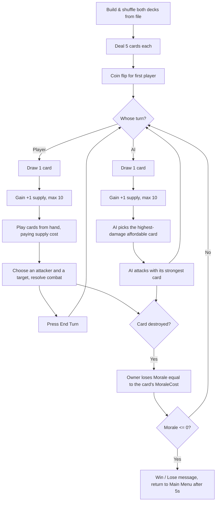
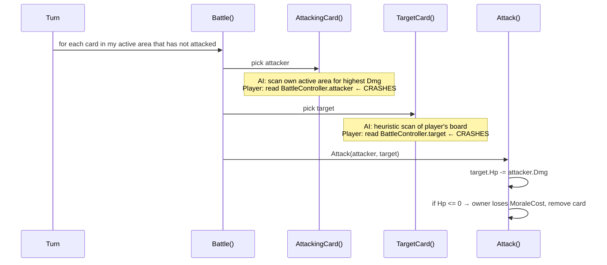

# Gameplay Loop

**Status:** Reverse-engineered 2026-07-28 by reading `Game.cs` line by line, then **verified against a real 2014 play session** recorded in `HToW_Data/output_log.txt`.

---

## 1. What the player actually experiences today

1. Main menu → "Battle Mode" → "Load Battle".
2. The Battle scene opens. Ten cards fan out — 5 in the player's hand, 5 face-down in the enemy's.
3. **Within about a fifth of a second, hundreds of turns silently execute.** The player's draw pile is emptied instantly. Nothing on screen indicates this.
4. From then on the game sits in a permanent free-running loop, taking a player turn and an AI turn every frame.
5. The player can click a card in hand. If it costs 1 or 2 supply it is played to the board; if it costs 3+ the click is rejected forever (see bug C4).
6. Roughly every 5 seconds the AI adds a card to its side.
7. As soon as the player has a card in play *and* the AI has a card in play, combat is attempted — and throws a `NullReferenceException` every frame from then on.
8. There is no way to win, lose, or end a turn. The "End Turn" button logs a message and does nothing.

**Where gameplay stops:** at the first attempted attack. Everything after that point — combat, morale, victory, defeat, the return to the menu — is unreachable in practice.

---

## 2. The intended loop (reconstructed from the code's aspirations)



This is a coherent and genuinely decent design: **supply is a ramping resource (Hearthstone-style mana), and morale is the life total — but you only lose morale when your *units die*, not from direct attacks.** That is an unusual and interesting core. See `GameDesign.md`.

---

## 3. Why the turn system is broken

Three independent defects compound:

**(a) `Update()` drives turns with no gate.**
```csharp
void Update() {
    if (m_state == GameState.Initial) InitialSetUp();
    if (m_state == GameState.Begin)
        for (int x = 0; x < 2; x++) { ChangeTurn(); LaunchTurn(); CheckForWinner(); }
}
```
`EndTurn()` sets `m_state = Begin` again at the end of every turn, so the condition is true on the very next frame. Nothing ever waits for player input. Turn rate = frame rate × 2.

**(b) The `playerTurnOver` flag is self-defeating.**
`LaunchTurn()` sets `playerTurnOver = false` *immediately before* calling `UserTurn()`, and `UserTurn()`'s only guard is `if (playerTurnOver == false)`. The guard can never fail. It is dead protection.

**(c) The "End Turn" button is not connected.**
`OnButton("EndTurn")` sets `buttonPushed = true`. **`buttonPushed` is never read anywhere in the codebase.** The button is decorative.

The AI half has a partial brake — `EnemyTurn()` accumulates `timer += Time.deltaTime` and only draws/plays when `timer >= timerMax` (5s). But it still runs its attack phase and calls `EndTurn()` every frame regardless. So the AI *plays* slowly while the turn counter *advances* at frame rate.

---

## 4. Evidence from the 2014 build log

`HToW_Data/output_log.txt` is a genuine play session. Log-line frequencies:

| Count | Log line | What it proves |
|---:|---|---|
| 1433 | `Begin` / `LaunchTurnNow` | `Update` ran the turn block ~716 times |
| 717 | `In User Turn` | 717 player turns |
| 716 | `In enemy turn` | 716 AI turns |
| 1432 | `Changing turn` | `EndTurn()` fired 1432 times |
| 717 | `Deck is empty` | the player's draw pile was empty on **every single turn** |
| 3 | `You have clicked a card` | the player managed to play 3 cards in the whole session |
| 12 | `Nay` | 12 clicks rejected by the supply check |
| 2 | `You have pushed the button` | End Turn pressed twice — nothing happened |
| 1 | `NullReferenceException` | combat crashed the moment it was first attempted |

**716 turns in roughly 12 seconds of play.** The `Deck is empty` count is the smoking gun for a second problem: `Assets/celtic.txt` contains exactly 5 cards, and `InitialSetUp()` draws 5. The player's draw pile is empty *before turn one begins*.

The recorded stack trace:

```
NullReferenceException: Object reference not set to an instance of an object
  at Game.AttackingCard (.CardDef selectAttacker)
  at Game.Battle ()
  at Game.UserTurn ()
  at Game.LaunchTurn ()
  at Game.Update ()
```

This is bug C1 in `KnownBugs.md`, confirmed empirically rather than merely suspected.

---

## 5. Resource economy as implemented

| Rule | Intended | Actual |
|---|---|---|
| Starting supply | 2 | 2, but never read by the play-a-card check |
| Supply per turn | +1, cap 10 | applied to `playerInstance`, which nothing consults |
| Supply spent on play | cost of card | **never deducted** |
| Starting morale | 30 (`BaseCharacter`) | **overwritten to 1** in `Start()` "for testing purposes" |
| Morale loss | when your own card dies, equal to its `MoraleCost` | correct in principle |

Because `MouseController` constructs a **brand-new `Player()`** on every click, the affordability test always compares against a fresh `StartSupply` of 2. Cards costing 1–2 are always playable; cards costing 3+ are never playable, no matter how long the game runs. The 12 `Nay` lines in the log are exactly this.

And because `Start()` sets both morale values to 1, a single card death would end the match instantly — if combat worked.

---

## 6. Deck totals and an unreachable loss condition

Morale only drains when your own units die. So a deck's **total MoraleCost is effectively its life pool**, and it must exceed starting morale or defeat is impossible.

| Deck | Cards | Total MoraleCost | vs. 30 starting morale |
|---|---|---|---|
| Celtic (`celtic.txt`) | 5 | **21** | Cannot lose, even if every card dies |
| Viking (`viking.txt`) | 11 | **72** | Can lose |

With the intended morale of 30, the player is literally unkillable and the AI is not. This asymmetry looks accidental, but the underlying rule ("your deck's total morale cost is your health bar") is a genuinely elegant design constraint worth keeping deliberately. See `GameDesign.md`.

---

## 7. Combat resolution as implemented



Combat is one-directional: **the defender never deals damage back.** Whether that was intended or simply unfinished is unknown; as a design choice it makes attacking strictly safe and removes most tactical tension. Flagged in `GameDesign.md`.

`Attack()` also destroys the GameObject only when the *player* kills an AI card. When the AI kills a player card, the card is removed from the data list but its GameObject remains on screen forever — a ghost card.

---

## 8. Summary of the gap

| Loop stage | State |
|---|---|
| Deck build & shuffle | ✅ works |
| Opening draw | ✅ works (but empties the Celtic deck) |
| Coin flip for initiative | ✅ works, then immediately ignored |
| Turn alternation | ❌ runs at frame rate |
| Draw step | ⚠️ works, but fires hundreds of times per second |
| Supply economy | ❌ tracked but never spent or read |
| Playing a card | ⚠️ works for cost ≤ 2; plays the *wrong card* (bug C2) |
| Combat | ❌ crashes on first use |
| Morale / death | ⚠️ logic present, unreachable |
| Win / lose | ⚠️ logic present, unreachable |
| Campaign, progression, save | ❌ do not exist |

The honest completion estimate for *battle* is around 35%, matching the original estimate. The completion estimate for the **game** — campaigns, progression, deckbuilding, history — is closer to **5%**.
