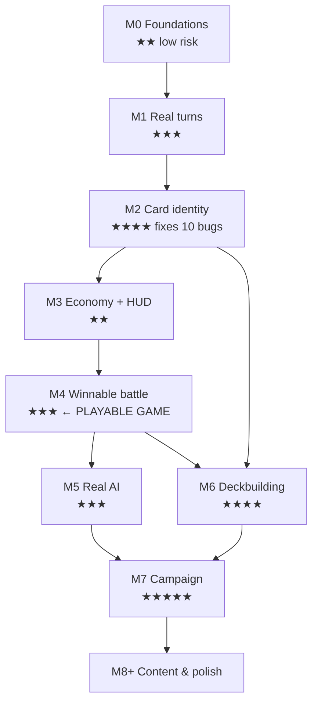

# Roadmap

**Drafted 2026-07-28 after the Phase 1 investigation.**

**Guiding principle: a playable game before a polished one.** The project has ~35% of a *battle* and ~5% of a *game*. Milestones 0–4 exist to get one complete, satisfying battle working end to end. Nothing about campaigns, history, or progression is worth building on top of combat that crashes.

Difficulty: ★ trivial · ★★ small · ★★★ moderate · ★★★★ large · ★★★★★ major.

---

## Milestone 0 — Foundations

**Goal:** a clean, reviewable, modern-Unity repo that is *equally* broken, not differently broken.

| | |
|---|---|
| Difficulty | ★★ |
| Risk | **Low** — no gameplay logic changes |
| Depends on | nothing |

**Work**
1. Add Unity `.gitignore`; untrack `HToW.exe` and `HToW_Data/` (extract `output_log.txt` findings first — already done, see `GameplayLoop.md` §4).
2. Delete dead code, dead assets, broken prefabs, Dropbox conflict files, `Thumbs.db`, orphan `.meta`s (`TechnicalDebt.md` §7). One clearly-labelled, wholesale-revertible commit.
3. Switch asset serialization to **Force Text**; commit the rewrite on its own.
4. Upgrade to Unity 6 LTS per `UnityUpgrade.md`.
5. Fix Build Settings (drop the two deleted scenes and the duplicate `Battle` entry).
6. Rewrite `README.md` to describe reality.

**Gameplay improvement:** none, deliberately.
**Exit criterion:** the project opens in Unity 6, compiles, and reaches the same broken state as today. Every asset is diffable.

---

## Milestone 1 — A real turn

**Goal:** turns advance when the player says so. **This is the single highest-value change in the project.**

| | |
|---|---|
| Difficulty | ★★★ |
| Risk | Medium — touches the core loop |
| Depends on | M0 |

**Work**
1. Extract `TurnController` from `Game.cs` — the first slice off the God class.
2. Replace the free-running `Update()` block with an explicit, event-driven state machine: `Draw → Main (waits for input) → End → opponent`.
3. Wire the **End Turn button** to actually end the turn (`buttonPushed` is currently written and never read).
4. Reset `HasAttacked` at the start of each turn (bug F2 — dormant today, appears the instant turns work).
5. Give the AI turn a visible, deliberate pace rather than a frame-rate race.
6. Show whose turn it is — `MessagePlayerTurn` / `MessageAITurn` already exist in the scene and are never displayed (bug M6).

**Fixes:** C3, M6, M7, F2.
**Gameplay improvement:** enormous. The game stops running 716 turns in 12 seconds and becomes something a human can observe.
**Exit criterion:** you can watch one player turn and one AI turn happen, in order, at human speed.

---

## Milestone 2 — Card identity and the data model

**Goal:** a card is an object, not a string. **This is the highest-leverage *refactor* in the project — it fixes six known bugs at once.**

| | |
|---|---|
| Difficulty | ★★★★ |
| Risk | Medium-high — the widest-reaching change |
| Depends on | M1 |

**Work**
1. Introduce `CardData : ScriptableObject` (immutable definition) and `CardInstance` (mutable runtime state: `currentHp`, `hasAttacked`, `owner`). This distinction is the thing the current `CardDef` most lacks.
2. Author the 9 existing cards as `CardData` assets — **restoring the abandoned `OldMethod` design**, including the `ctype`/`ceffect` fields recovered in `CardSystem.md` §4c.
3. Introduce `DeckData : ScriptableObject` to replace the `.txt` ID lists and delete the 9-branch `if` chain in `Deck.AddToDeck()`.
4. Split `Deck` into `CardPile` (ordered) and `Board` (a set) — this is what fixes bug C2.
5. Replace name-string identity, Unity tags, and `FindGameObjectWithTag` with object references.
6. Collapse the four card-construction methods into **one `CardView` prefab + a factory**.
7. Move card selection state out of `BattleController` into a proper selection service (bug C1).

**Fixes:** C1, C2, C5, C6, M3, M4, M5, N1, N6, F3.
**Gameplay improvement:** combat stops crashing; playing a card plays the card you clicked.
**Exit criterion:** you can play a card, select an attacker and a target, and kill something without an exception.

> **Why one big milestone rather than seven small fixes:** C1, C2, C5, M3, M4 and M5 are all symptoms of one root cause (string identity + pile-modelled board). Patching them individually means writing six workarounds and then deleting all of them. This is the exception to "small reviewable steps" — but it should still be *implemented* as a sequence of small commits, each compiling.

---

## Milestone 3 — The economy made real and visible

**Goal:** supply and morale actually work, and the player can see them.

| | |
|---|---|
| Difficulty | ★★ |
| Risk | Low |
| Depends on | M2 |

**Work**
1. Make `MouseController` consult the **real** player, not `new Player()` (bug C4), and **deduct** supply on play.
2. Remove the `//For testing purposes` morale override of 1 (bug M10).
3. Build the HUD: morale and supply for both sides. The TextMesh objects and `hp.png`/`supplyicon.png` already exist and are wired to nothing (bug M8).
4. Show card stats **on the card face** — HP, damage, cost are currently invisible to the player entirely. Use the unused `cardfront.png` frame.
5. Give clear feedback when a card is unaffordable (currently a silent `Debug.Log("Nay")`).

**Fixes:** C4, M8, M10.
**Gameplay improvement:** the resource curve becomes the actual decision the player is making. Cards above cost 2 become playable for the first time.
**Exit criterion:** a player who has never seen the code can understand why they can't play a card.

---

## Milestone 4 — A battle you can win or lose

**Goal:** the first genuinely complete gameplay loop in the project's history.

| | |
|---|---|
| Difficulty | ★★★ |
| Risk | Medium — this is where design decisions bite |
| Depends on | M3 |

**Work**
1. Decide and implement **combat retaliation** (see `GameDesign.md` §3 — currently the defender never fights back, which removes nearly all tactical tension).
2. Add a **discard pile**; decide reshuffle-vs-fatigue on deck-out.
3. Rebalance both decks to ~20–30 cards; ensure each deck's total MoraleCost meaningfully exceeds starting morale (bugs M11, M12 — the Celtic deck currently *cannot lose*).
4. Rebalance the 9 cards (`CardSystem.md` §3 — Fianna is overpowered, Bondi is strictly dominated by Ceithern, the 6-cost cards are unreachable).
5. Win/lose screens that don't hard-cut to the main menu after 5 seconds.

**Fixes:** M11, M12, F1.
**Gameplay improvement:** **this is the milestone where HToW becomes a game.** Everything before it is repair.
**Exit criterion:** you can sit down, play a full battle, and win or lose for reasons you understand.

> **Stop here and play it for a week before continuing.** Everything after this point is content built on the assumption that the core battle is fun. If it isn't, that's much cheaper to discover now.

---

## Milestone 5 — An opponent worth playing

| | |
|---|---|
| Difficulty | ★★★ |
| Risk | Low — self-contained |
| Depends on | M4 |

**Work**
1. **Make the AI legal first:** it must draw into its hand, play *from* its hand, remove played cards, and pay supply. It currently plays from an infinite deck and ignores its hand entirely (bug M1). Balance is meaningless until this is true.
2. Extract `AIController` from `Game.cs`.
3. Replace the if-chain heuristics with a **scoring function** (`AI.md` §7) that weights `MoraleCost` — the AI currently has no concept of the win condition.
4. Add difficulty tiers by perturbing weights / occasionally choosing the second-best move.

**Fixes:** M1, M2.
**Gameplay improvement:** the opponent stops cheating and starts playing.

---

## Milestone 6 — Deckbuilding

| | |
|---|---|
| Difficulty | ★★★★ |
| Risk | Medium |
| Depends on | M2, M4 |

**Work**
1. A card-collection browser — the "Cards" main-menu button currently shows *"Sorry N/A"*.
2. A deck editor writing `DeckData` (the abandoned `Custom.asset` shows this was always the plan).
3. Deck legality rules (size, copy limits, faction restrictions).
4. Persistence — the **first save system in the project**.

**Gameplay improvement:** the "deckbuilding" half of "deckbuilding card battler" finally exists. Until this milestone the genre label isn't earned.

---

## Milestone 7 — Campaign structure

| | |
|---|---|
| Difficulty | ★★★★★ |
| Risk | High — largest design surface, almost nothing exists |
| Depends on | M6 |

`Level1.unity` is an empty scene containing one camera. This is genuinely the ~0%-complete part of the project.

**Work**
1. Campaign map / node progression.
2. Battle configuration data (opponent deck, starting morale, special rules) as ScriptableObjects.
3. Between-battle rewards and deck evolution — the *run* structure.
4. Narrative/historical presentation between battles.
5. Save/load for campaign progress.
6. Build the **Celtic Ireland** campaign end to end as the vertical slice.

**Gameplay improvement:** delivers the actual project vision.

---

## Milestone 8+ — Content, polish, systems

Later, and only in this order: remaining campaigns (Viking, Brian Boru, Norman) · card abilities (`Volley`/`United`/`Berserker`/`Bloodrush` were already designed — `CardSystem.md` §4c) · Generals (art and scene objects already exist) · animation and effects (`FlyTime` was an intended card-flight tween) · audio · settings and accessibility.

---

## Dependency graph

---

## Honest scale estimate

| Milestones | Outcome |
|---|---|
| M0–M4 | **A complete, winnable single battle.** The bulk of the repair work. |
| M5–M6 | A real opponent and actual deckbuilding. |
| M7 | One playable historical campaign. |
| M8+ | The full vision — open-ended. |

M0–M4 is the section that converts this from an archaeology project into a game, and it is mostly *repair and refactor* rather than new features. Expect the second half of M2 to be the hardest stretch.

## Immediate next step

**Milestone 0, step 1–3** — `.gitignore`, dead-code deletion, Force Text. All low-risk, all reversible, and they make everything afterwards visible. No gameplay decisions required, so no need to resolve any open design questions first.
